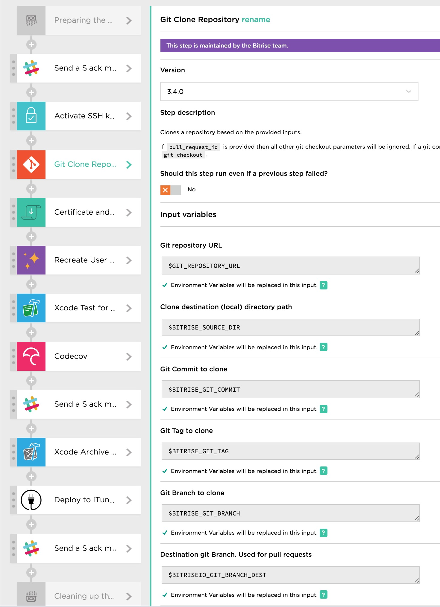

# Bitrise

## What?

[Bitrise](https://www.bitrise.io) is an automation tool for continuous delivery of mobile apps. By setting up a workflow one can trigger multiple processes to run, from testing to compiling to deploying to Testflight or the App Store. 


## How do I?

- [Getting Started](http://devcenter.bitrise.io/docs)
- [Continuous Integration with Bitrise.io](https://www.youtube.com/watch?v=olfpwEjVlZ4)

## Workflows



We push to branch to trigger builds. 

For ```master``` the builds go to iTunes Connect

For ```dev``` the builds go to Fabric

For ```feature/*``` the builds go to test

- TLB's workflow: [bitrise.yml](bitrise.yml)