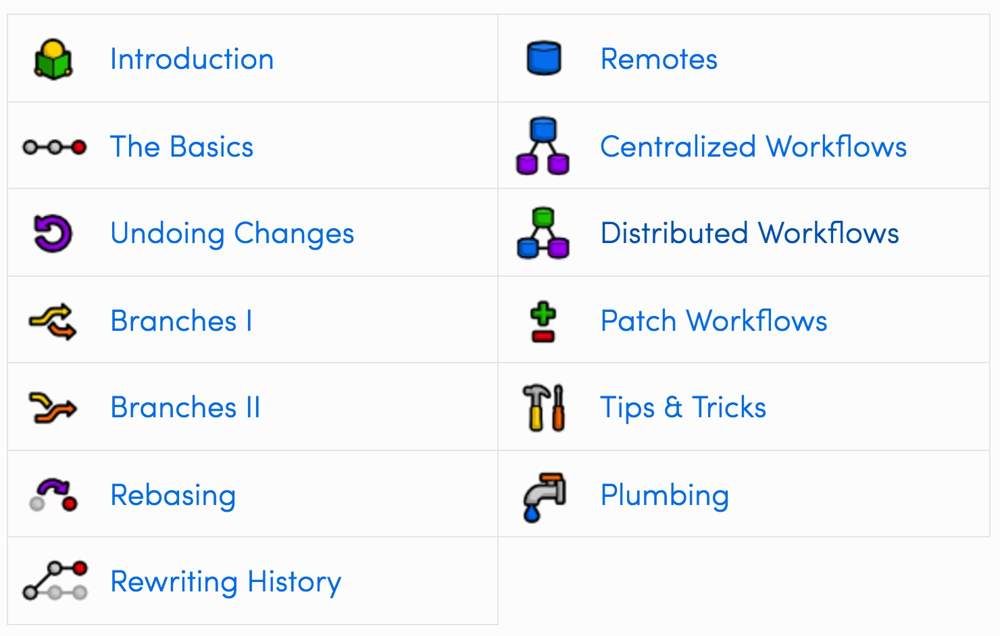

# Git

## How do I git?

Read [Ry's Git Tutorial](http://rypress.com/tutorials/git/index) to get started with the basics of using git as a version control system. Pay particular attention to branching, rebasing, and remotes.

Keep the distributed workflow method in mind so that when working with a team you can understand what is happening.

## Git club rules

The only rule in git club: *do not commit to master*.

The second rule in git club: *master must be deployable*.

The third rule in git club: *no emojis in commit message*.

## What should I name the branches?

Best practice for naming branches is here: [branching model](http://nvie.com/posts/a-successful-git-branching-model/)